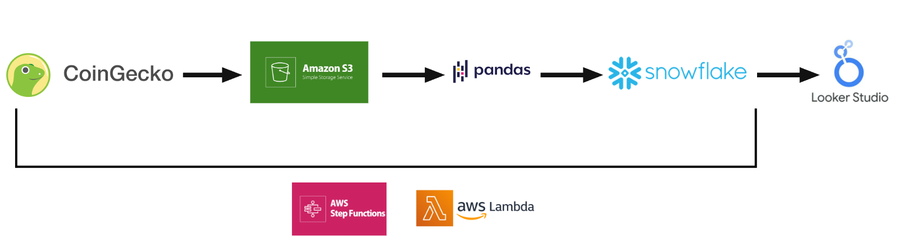

# Cloud ETL Pipeline for Cryptocurrency Market Snapshot

This project builds a cloud-native pipeline that extracts real-time cryptocurrency market data from the [CoinGecko API](https://www.coingecko.com/), stores data in **AWS S3 Bucket**, transforms it with **pandas**, and loads it into a **Snowflake** table for visualization in **Google Looker Studio**. All scripts are deployed in **AWS Lambda**, and orchestrated by **AWS Step Functions state machines**.

## Pipeline Workflow

- **Extract**:
   - Data is fetched from the CoinGecko API using a Lambda function (`extract_crypto_data`).
   - Raw JSON data is stored in an S3 bucket (`cm--raw-data`).

- **Transform**:
   - Data transformation is handled by another Lambda function (`transform_crypto_data`) using pandas to:
     - Clean data
     - Calculate additional fields (e.g., dominance percentage, volume percentage).
   - Transformed data is stored as a CSV file in the same S3 bucket.

- **Load**:
   - A third Lambda function (`load_crypto_data`) loads the processed CSV data into Snowflake:
     - Database: `CRYPTO_ETL_DB`
     - Table: `CRYPTO_DATA`

- **Orchestrate**:
   - All lambda functions are orchestrated by a state machine (`crypto_etl_state_machine_light`)
   - Output of previous state is used as input of next state to ensure seamless processing.
   - Can be manually triggered on-demand

- **Visualize**:
   - Data in Snowflake table is connected to and visualized in Looker Studio
     - [Crypto Market Snapshot](https://lookerstudio.google.com/s/gLuxBDnvJQg)
     - Refresh data on-demand
     - Provide a real-time snapshot of the global cryptocurrency market
     - Metrics include market cap, price changes percentage etc.

## Future Improvements

- When cost is no longer a concern:
   - Automate pipeline execution to enable trend analytics of snapshot data.
   - Introduce **PySpark** with **AWS Glue** for big data.

- Testing and quality assurance:
   - Add alerting and monitoring for failures using **Amazon CloudWatch**.
   - Add data quality checks in Snowflake.

## Demo Run
- The scripts in the repository are not runnable as they are for Lambda deployment.
- To run the pipeline, use the credential file in the repo to log into AWS console as an **IAM user**.
- Once logged in, search for "state machines" and click the corresponding service.
- You should see a state machine called `crypto_etl_state_machine_light`.
- Click it then choose `Start execution`, name your execution differently to history records then proceed.
- For security concern minimum permissions are granted, you can't access Lambda functions involved or logs of the execution, but other details of the execution are avaialble.
- After execution, open Looker report and click the blue three-dot on top right, select `Refresh data`, then click `FETCH_DATA` filter, you can now visualize the latest market data fetched by your run.
